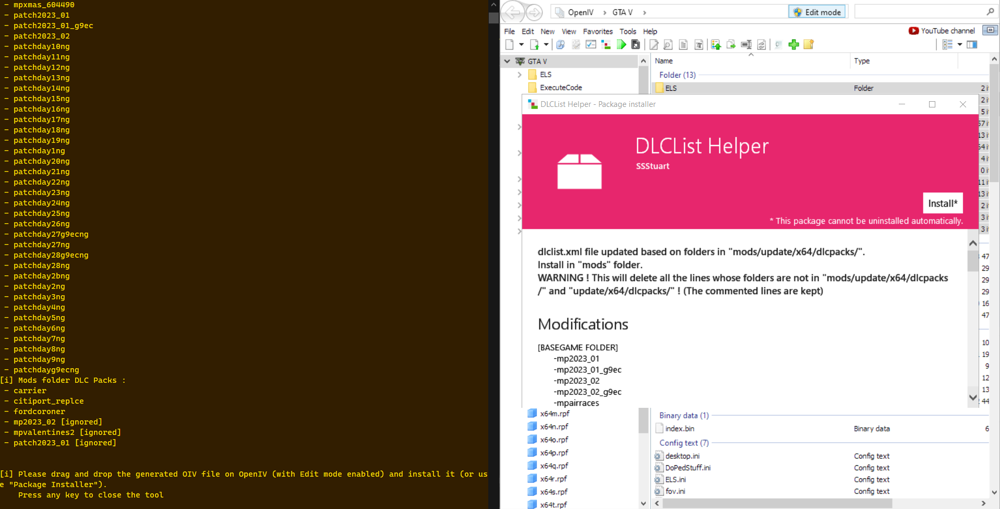

# DLCList Helper

A small console app that generates the dlclist.xml file (GTA 5 modding) based on the folders contained in the "dlcpacks" folder (original and "mods"). 
Simplifies the installation of add-on mods and the updating of the "mods" folder after a game update.

